# MQTT Crypto Monitor

**Integrasi Sistem — Minggu 10**

> Sistem monitoring harga cryptocurrency real-time berbasis protokol **MQTT v5**, dilengkapi dashboard web interaktif yang menampilkan bukti implementasi seluruh 10 fitur MQTT secara langsung.

---

## 👥 Tim Pengembang

| Nama | NRP |
|------|-----|
| Hanif Mawla Faizi | 5027241064 |
| M. Hikari Reiziq Rakhmadinta | 5027241079 |

---

## 🖥️ Tampilan Dashboard

Dashboard diakses melalui `http://localhost:3000` dan menampilkan seluruh data secara real-time melalui koneksi WebSocket ke MQTT broker.

### Halaman Utama — Bagian Atas
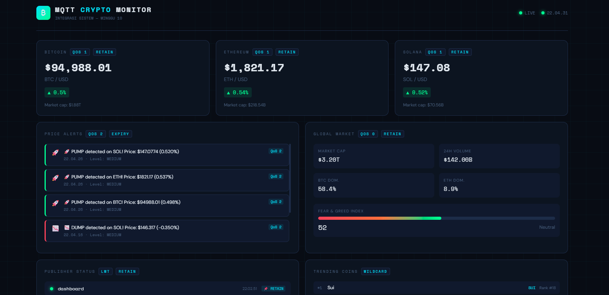

Bagian atas dashboard menampilkan:
- **Harga live** BTC, ETH, dan SOL dengan badge QoS dan Retain
- **Price Alerts** (PUMP/DUMP) dengan QoS 2 dan Message Expiry
- **Global Market** stats (Market Cap, Volume, BTC/ETH Dominance, Fear & Greed Index)
- **Publisher Status** dengan indikator LWT dan Retain

### Halaman Utama — Bagian Tengah
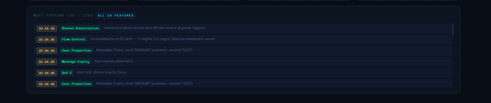

Bagian tengah dashboard menampilkan:
- **Wildcard Topics** (Fitur 2): visualisasi `crypto/#` dan `crypto/price/+`
- **Topic Alias** (Fitur 3): mapping integer alias 1→2→3 ke nama topik panjang
- **Shared Subscription** (Fitur 9): distribusi alert antara Dashboard dan Logger
- **Flow Control** (Fitur 10): `receiveMaximum` per client dengan progress bar

### Halaman Utama — MQTT Feature Log
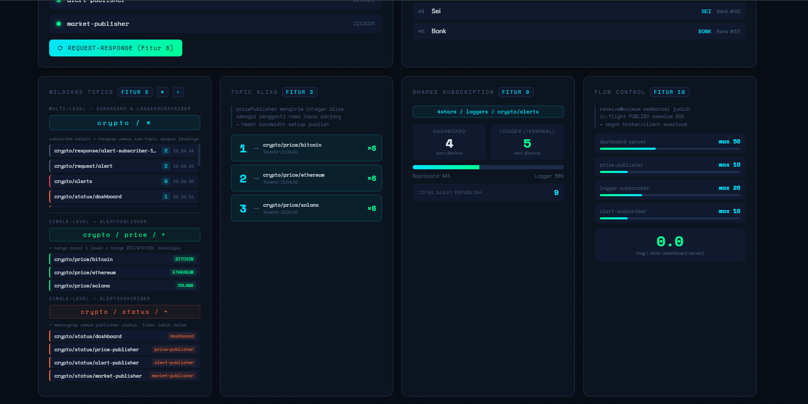

Bagian bawah menampilkan **MQTT Feature Log — Live** yang mencatat semua 10 fitur secara real-time: Shared Subscription, Flow Control, User Properties, Message Expiry, QoS 2, Retain, dan lainnya.

---

## 📐 Arsitektur Sistem

```
CoinGecko API
     │
     ▼
┌─────────────────────────────────────────────┐
│              MQTT BROKER (Aedes)            │
│                 port: 1883                  │
└──────────┬──────────────────┬───────────────┘
           │                  │
    PUBLISH│                  │SUBSCRIBE
           │                  │
┌──────────▼──────┐   ┌───────▼──────────────┐
│   Publishers    │   │     Subscribers       │
│                 │   │                       │
│ 1. pricePublisher│  │ 1. loggerSubscriber   │
│    - BTC/ETH/SOL│   │    - Wildcard #       │
│    - QoS 1      │   │    - Shared Sub       │
│    - Retain     │   │                       │
│    - TopicAlias │   │ 2. alertSubscriber    │
│    - UserProps  │   │    - QoS 2            │
│    - MsgExpiry  │   │    - Request-Response │
│    - LWT        │   │    - Wildcard +       │
│                 │   └───────────────────────┘
│ 2. alertPublisher│          │
│    - QoS 2      │          │WEBSOCKET
│    - MsgExpiry  │          ▼
│    - LWT        │  ┌───────────────┐
│    - Req-Resp   │  │   Dashboard   │
│                 │  │  localhost:3000│
│ 3. marketPublish│  └───────────────┘
│    - QoS 0      │
│    - Retain     │
│    - LWT        │
└─────────────────┘
```

Data harga diambil dari **CoinGecko API** (gratis, tanpa API key), dikirim melalui tiga publisher ke MQTT broker **Aedes**, lalu dikonsumsi oleh subscriber dan dashboard melalui WebSocket bridge.

---

## ✅ Bukti Implementasi 10 Fitur MQTT

### Fitur 1 — Publish/Subscribe & QoS

Tiga level QoS diimplementasikan secara bersamaan:
- **QoS 0** — `marketPublisher` (market global, best-effort)
- **QoS 1** — `pricePublisher` (harga BTC/ETH/SOL, at-least-once)
- **QoS 2** — `alertPublisher` (alert PUMP/DUMP, exactly-once)

**Bukti Dashboard:**

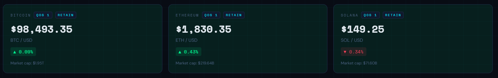

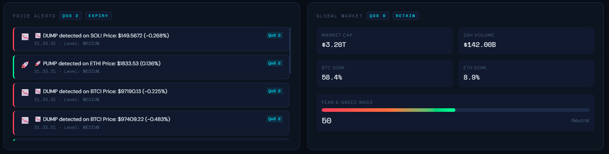

**Bukti Terminal:**

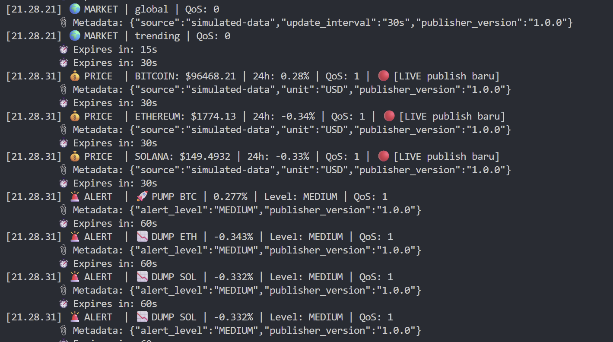

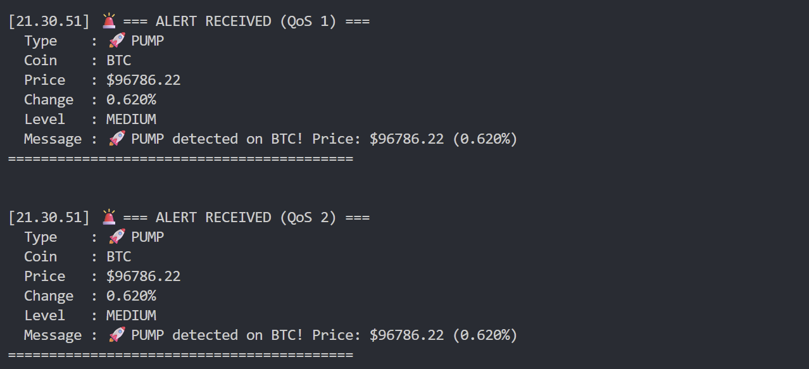

---

### Fitur 2 — Topic Wildcards

Dua jenis wildcard digunakan:
- `crypto/#` — multi-level, digunakan dashboard dan `loggerSubscriber` untuk menangkap semua sub-topik
- `crypto/price/+` — single-level, menangkap harga BTC/ETH/SOL sekaligus
- `crypto/status/+` — single-level, digunakan `alertSubscriber` untuk memantau status semua publisher

**Bukti Dashboard:**

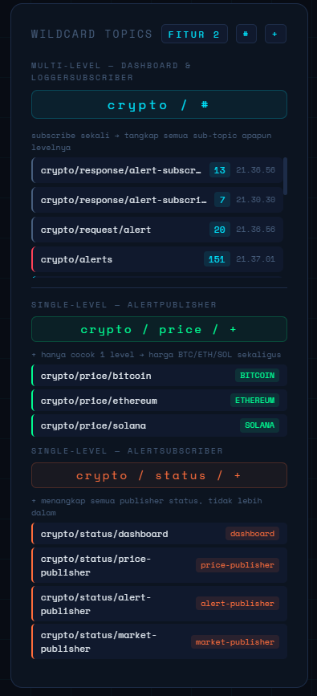

**Bukti Terminal:**


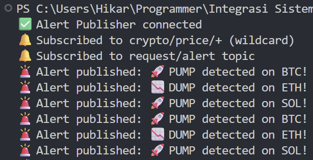

---

### Fitur 3 — Topic Alias

`pricePublisher` memetakan nama topik panjang ke integer alias untuk menghemat bandwidth pada setiap pesan berikutnya:
- `1` → `crypto/price/bitcoin`
- `2` → `crypto/price/ethereum`
- `3` → `crypto/price/solana`

**Bukti Dashboard:**


**Bukti Terminal:**


---

### Fitur 4 — User Properties

Setiap pesan publish menyertakan metadata MQTT v5 User Properties: `source`, `unit`, `publisher_version`, dan `alert_level`. Data ini ditampilkan di MQTT Feature Log.

**Bukti Dashboard:**


**Bukti Terminal:**


---

### Fitur 5 — Retain

Pesan dengan flag `retain: true` disimpan di broker sehingga subscriber yang baru terkoneksi langsung menerima data terbaru tanpa menunggu publish berikutnya. Diterapkan pada topik harga dan status publisher.

**Bukti Dashboard:**

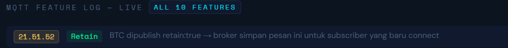

**Bukti Terminal:**

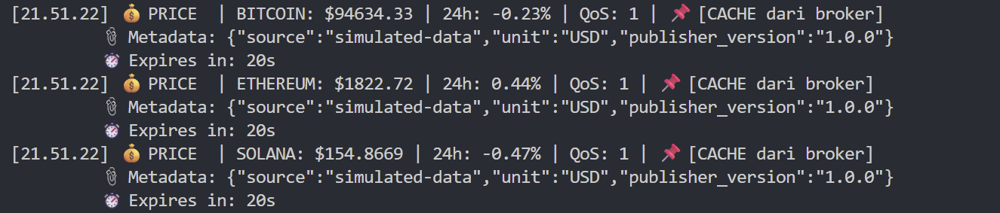

---

### Fitur 6 — Message Expiry

Setiap pesan alert memiliki TTL (Time-to-Live) 60 detik dan pesan harga 30 detik. Pesan yang sudah kedaluwarsa tidak akan dikirim ke subscriber yang baru connect.

**Bukti Dashboard:**


**Bukti Terminal:**


---

### Fitur 7 — Last Will Testament (LWT)

Semua publisher mendaftarkan LWT ke broker saat connect. Jika publisher mati mendadak (crash / `Ctrl+C`), broker otomatis mempublikasikan pesan "offline" ke topik `crypto/status/<publisher-name>` dengan flag Retain.

**Bukti Dashboard:**


**Bukti Terminal:**


---

### Fitur 8 — Request-Response

Dashboard memiliki tombol **REQUEST-RESPONSE** yang mengirim pesan ke `crypto/request/alert`. `alertPublisher` mendeteksi request dan membalas ke topik `crypto/response/<correlationId>` dengan status, threshold, dan daftar koin yang dipantau.

**Bukti Dashboard:**

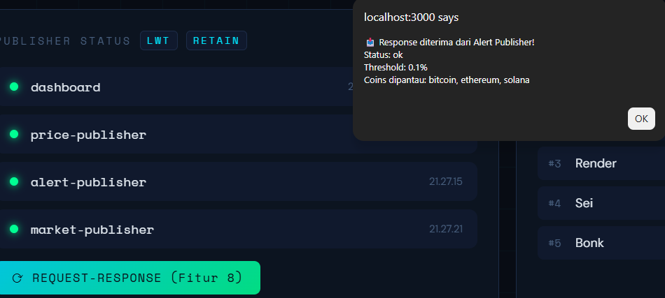

**Bukti Terminal:**

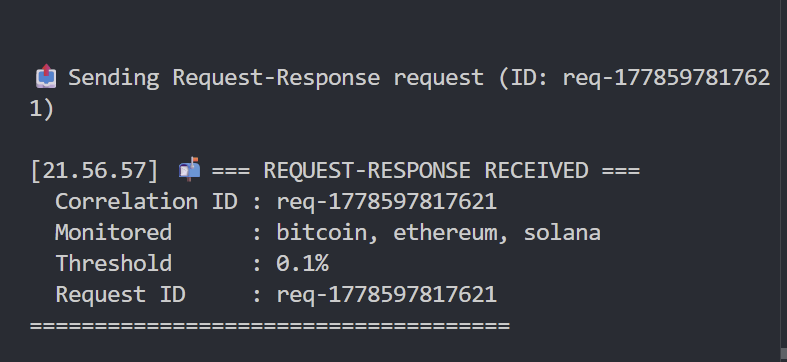

---

### Fitur 9 — Shared Subscription

`loggerSubscriber` (terminal) dan dashboard server sama-sama subscribe ke `$share/loggers/crypto/alerts`. Broker mendistribusikan setiap alert hanya ke salah satu dari keduanya secara bergantian (load balancing), sehingga tidak ada duplikasi pemrosesan.

**Bukti Dashboard:**


---

### Fitur 10 — Flow Control

Setiap client mengatur `receiveMaximum` untuk membatasi jumlah pesan in-flight sebelum ACK, mencegah overload pada broker maupun client:

| Client | receiveMaximum |
|--------|---------------|
| dashboard-server | 50 |
| price-publisher | 10 |
| logger-subscriber | 20 |
| alert-subscriber | 10 |

**Bukti Dashboard:**


---

## 🛠️ Setup & Cara Menjalankan

### 1. Install dependencies
```bash
npm install
```

### 2. Jalankan semua komponen (buka terminal terpisah untuk tiap komponen)

**Terminal 1 — MQTT Broker:**
```bash
node broker/broker.js
```

**Terminal 2 — Dashboard Server:**
```bash
node dashboard/server.js
```

**Terminal 3 — Price Publisher:**
```bash
node publishers/pricePublisher.js
```

**Terminal 4 — Alert Publisher:**
```bash
node publishers/alertPublisher.js
```

**Terminal 5 — Market Publisher:**
```bash
node publishers/marketPublisher.js
```

**Terminal 6 — Logger Subscriber:**
```bash
node subscribers/loggerSubscriber.js
```

**Terminal 7 — Alert Subscriber:**
```bash
node subscribers/alertSubscriber.js
```

### 3. Buka Dashboard
```
http://localhost:3000
```

---

## 📁 Struktur Project

```
mqtt-crypto-monitor/
├── broker/
│   └── broker.js              # MQTT Broker (Aedes)
├── publishers/
│   ├── pricePublisher.js      # Publisher 1: Harga BTC/ETH/SOL
│   ├── alertPublisher.js      # Publisher 2: Alert pergerakan harga
│   └── marketPublisher.js     # Publisher 3: Global market stats
├── subscribers/
│   ├── loggerSubscriber.js    # Subscriber 1: Log semua data
│   └── alertSubscriber.js     # Subscriber 2: Handle alerts
├── dashboard/
│   ├── server.js              # HTTP + WebSocket bridge
│   └── public/
│       └── index.html         # Dashboard UI real-time
├── image/
│   ├── Dashboard_main_1.png   # Screenshot dashboard (atas)
│   ├── Dashboard_main_2.png   # Screenshot dashboard (tengah)
│   ├── Dashboard_main_3.png   # Screenshot dashboard (feature log)
│   ├── Dashboard/             # Bukti 10 fitur dari dashboard
│   └── Terminal/              # Bukti 10 fitur dari terminal
├── package.json
└── README.md
```

---

## 🔑 Topic Structure

```
crypto/
├── price/
│   ├── bitcoin        ← QoS 1, Retain, TopicAlias 1, UserProps, Expiry 30s
│   ├── ethereum       ← QoS 1, Retain, TopicAlias 2, UserProps, Expiry 30s
│   └── solana         ← QoS 1, Retain, TopicAlias 3, UserProps, Expiry 30s
├── alerts             ← QoS 2, Expiry 60s, SharedSub
├── market/
│   ├── global         ← QoS 0, Retain, Expiry
│   └── trending       ← QoS 0, Retain, Expiry
├── status/
│   ├── price-publisher    ← Retain, LWT
│   ├── alert-publisher    ← Retain, LWT
│   ├── market-publisher   ← Retain, LWT
│   └── dashboard          ← Retain, LWT
├── request/
│   └── alert          ← Request-Response trigger
├── response/
│   └── <correlationId>    ← Response dari alertPublisher
└── errors             ← QoS 1
```

---

## 💡 Tips Demo

| Fitur | Cara Demo |
|-------|-----------|
| **LWT** | Matikan publisher dengan `Ctrl+C`, lihat status berubah merah di dashboard |
| **Retain** | Buka dashboard setelah publisher jalan — harga langsung muncul tanpa menunggu |
| **Request-Response** | Klik tombol REQUEST-RESPONSE di dashboard, lihat popup balasan dari alertPublisher |
| **Shared Sub** | Perhatikan counter di panel Shared Subscription — alert terbagi antara dashboard dan logger |
| **Topic Alias** | Lihat panel Topic Alias — counter `×N` bertambah setiap publish |
| **Flow Control** | Lihat progress bar di panel Flow Control bergerak saat traffic tinggi |
